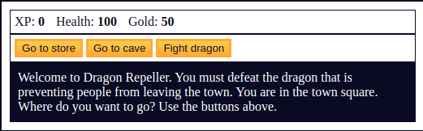

### Learning
- In this project, we'll learn fundamental programming concepts in JavaScript by coding our own Role Playing Game. 
- We'll learn how to work with arrays, strings, objects, functions, loops, if/else statements, and more.

### Here's a preview of what you will build

You previously used an array to store strings. But arrays can store any data type. This time, your array will be storing objects. Objects are similar to arrays, but with a few differences. One difference is that objects use properties, or keys, to access and modify data.

Objects are indicated by curly braces. An empty object would look like {}.

Add an empty object to your locations array.

Object properties are written as key: value pairs, where key is the name of the property (or the key), and value is the value that property holds. For example, here is an object with a key of name set to Quincy Larson.

{
  name: "Quincy Larson"
}

Just like array values, object properties are separated by a comma. Add a comma after your name property and add a button text property with the value of an empty array.

Note that, because the property name has more than one word, you'll need to surround it in quotes. For example:
{
  name: "Naomi",
  "favorite color": "purple"
}

The value of the currentWeapon variable corresponds to an index in the weapons array. The player starts with a stick, since currentWeapon starts at 0 and weapons[0] is the stick weapon.

In the buyWeapon function, use compound assignment to add 1 to currentWeapon - the user is buying the next weapon in the weapons array.

The attack of the monster will be based on the monster's level and the player's xp. In the getMonsterAttackValue function, use const to create a variable called hit. Assign it the equation (level * 5) - (Math.floor(Math.random() * xp));.
This will set the monster's attack to five times their level minus a random number between 0 and the player's xp.

If you play the game in its current state you might notice a bug. If your xp is high enough, the getMonsterAttackValue function will return a negative number, which will actually add to your total health when fighting a monster!

In getMonsterAttackValue, change return hit to a ternary operator that returns hit if hit is greater than 0, or returns 0 if it is not.

